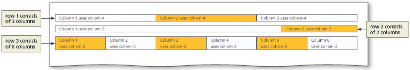

# Bootstrap

[Introduction](#introduction)

[Exploring Bootstrap](#exploring-bootstrap)

[Bootstrap navigation bar](#bootstrap-navigation-bar)

[Bootstrap Responsive Containers](#bootstrap-responsive-containers)

[Bootstrap Jumbotron](#bootstrap-jumbotron)

[Margins and Padding](#margins-and-padding)

[images](#images)

[Bootstrap Colors](#bootstrap-colors)

[Styling Button](#styling-button)

[Custom Styles](#custom-styles)

[Using JQuery](#using-jquery)

[Using the Bootstrap grid System](#using-the-bootstrap-grid-system)

[Bootstrap Typography Classes](#bootstrap-typography-classes)

[Styling Tables with Bootstrap](#styling-tables-with-bootstrap)

[Content Management Systems CMS](#content-management-systems)


# Introduction

[Back](#bootstrap) | [Forward](#exploring-bootstrap)

## 🌐 Overview of Modern Web Development Tools
Many of today’s modern websites use some form of **content management system (CMS)** or **web framework**. These tools provide structured environments that help developers create **beautiful**, **responsive**, and **maintainable** webpages far more efficiently than working with a standard text editor alone.

A **CMS** handles content creation and organization, while a **web framework** provides reusable code patterns, layout systems, and styling conventions. Both approaches reduce the amount of manual coding required and ensure greater consistency across pages.

## 🧱 Introduction to Bootstrap (Framework Focus)
This chapter provides an introduction to **Bootstrap**, a popular **front-end web framework** designed to simplify the process of creating **responsive** webpages. Bootstrap includes:

- A **CSS foundation** with normalized styling  
- A structured **grid system**  
- A suite of UI **components**  
- Built-in **JavaScript behaviors**  
- A library of **utility classes**  

Throughout this chapter, you will learn how to:

- Use **Bootstrap’s starter template** as a foundation for your webpage  
- Integrate and design a **responsive navigation system** using Bootstrap components  
- Create a **hero feature** using Bootstrap’s layout and utility classes  
- Use the **Bootstrap grid system** to organize webpage content  
- Style **text**, **images**, and a **table** using predefined Bootstrap classes  

## 🗂️ CMS Awareness
Finally, this chapter introduces the basics of **content management systems**, helping you understand how Bootstrap-based development fits within larger website architectures used in industry.

[Back Home](#bootstrap)


<br>
<br>
<br>
<br>
<br>


# Exploring Bootstrap

[Back Home](#bootstrap) | [Back](#introduction) | [Forward](#bootstrap-navigation-bar)


Bootstrap is a **popular, mobile-first, front-end, responsive design web framework**. A **web framework** is a development tool built from **HTML**, **CSS**, and **JavaScript**. It provides a **standardized foundation** for building websites and greatly simplifies development by offering **predefined style sheets**, **responsive layout systems**, and **script files** designed to handle common UI patterns.

The Bootstrap homepage, shown in **Figure 12–4**, is available here:

👉 **[https://getbootstrap.com](https://getbootstrap.com)**
Source: getbootstrap.com

As of the publication date referenced in your text, **Bootstrap 4** is the most current version. To begin using Bootstrap, developers must either **download** its CSS/JS assets or **link the framework through the Bootstrap CDN**.

A **`CDN (Content Delivery Network)`** is a **global network of distributed servers** that delivers files from the server **geographically closest to the user**, improving speed and reducing latency. When a page links to a CDN, assets like style sheets and scripts load **significantly faster**, regardless of the user’s location.

To connect your webpage to the Bootstrap CDN, the chapter provides the standard `<link>` element. This link loads the **minified** version of Bootstrap’s CSS file (**bootstrap.min.css**). Because CDN URLs occasionally update, you should always verify the most current version here:

👉 **[https://www.bootstrapcdn.com](https://www.bootstrapcdn.com)**

If you prefer a readable version of Bootstrap’s stylesheet, you can view the **non-minified** source shown in **Figure 12–5** at:

👉 **[https://stackpath.bootstrapcdn.com/bootstrap/4.3.1/css/bootstrap.css](https://stackpath.bootstrapcdn.com/bootstrap/4.3.1/css/bootstrap.css)**
Source: stackpath.bootstrapcdn.com

---

## 🎨 Understanding the Non-Minified Bootstrap CSS (Expanded with Key Terms)

When viewing the non-minified Bootstrap file, you are looking at the **complete design system** Bootstrap uses to style every element and component it supports. It contains:

* **Hundreds of style rules** for HTML elements
* **Structural layout definitions**
* **Grid system configuration**
* **Component-level classes** (buttons, navbars, cards, modals, alerts, forms, tables)
* **Spacing utilities** (`m-`, `p-`, `mt-`, `px-`, etc.)
* **Color and background utilities**
* **Typography utilities** (`lead`, `font-weight-bold`, `text-muted`)
* **Flexbox utilities**
* **Responsive helpers**
* **Media queries** that determine when layout changes occur

This file is generated from Bootstrap’s original **Sass source**, which includes **variables**, **mixins**, **nested rules**, and **maps** that define the entire design language.

Once your webpage links to Bootstrap (via local files or CDN), **all of these style rules automatically apply** to your HTML. You activate them by assigning **class attributes** to elements.

Examples:

```html
<p class="text-white">White text</p>

<div class="bg-primary text-light p-3">Styled block</div>
```

Each of these classes corresponds to a predefined rule in the Bootstrap stylesheet.

For a complete listing of Bootstrap 4 class names, the text references:

👉 **[https://www.w3schools.com/bootstrap4/bootstrap_ref_all_classes.asp](https://www.w3schools.com/bootstrap4/bootstrap_ref_all_classes.asp)**

---

## 🖥️ BTW — Internet Explorer and Bootstrap 4

Bootstrap 4 is **not supported** by **Internet Explorer 9** or earlier.
These browsers lack support for many of the modern CSS features (flexbox, viewport units, transitions) that Bootstrap 4 depends on.

This is why modern frameworks generally consider IE9 “legacy” or “unsupported.”

---

## 🌐 Bootstrap Starter Template

Bootstrap provides an official **Starter Template**, shown in **Figure 12–6**, located at:

👉 **[https://getbootstrap.com/docs/4.3/getting-started/introduction/](https://getbootstrap.com/docs/4.3/getting-started/introduction/)**
Source: getbootstrap.com

The starter template includes:

* Basic **HTML5 document structure**
* Required **meta viewport** tag for responsive scaling
* `<link>` to Bootstrap’s CSS
* Three `<script>` elements above `</body>` linking to:

  * **jQuery**
  * **Popper.js**
  * **Bootstrap’s JavaScript**

These scripts unlock Bootstrap’s interactive components.

### Why these scripts matter:

* **jQuery** enables event handling and DOM manipulation
* **Popper.js** manages element positioning (especially **dropdowns**, **tooltips**, **popovers**)
* **Bootstrap’s JS** activates components like the **hamburger menu**, **collapse**, **modals**, **carousels**, and **dropdowns**

Without these dependencies, Bootstrap’s dynamic features will not function.

---

## 📱 Consider This — Expanded: How Many Media Queries Does Bootstrap Use?

Bootstrap 4.3 is built around **four primary responsive breakpoints**:

| Breakpoint | Min Width | Device Category |
| ---------- | --------- | --------------- |
| **sm**     | 576px     | Large phones    |
| **md**     | 768px     | Tablets         |
| **lg**     | 992px     | Laptops         |
| **xl**     | 1200px    | Desktops        |

Bootstrap uses these breakpoints across its **grid system**, **spacing utilities**, **typography scaling**, and **component structure**.

### Why these specific breakpoints?

Bootstrap’s breakpoints reflect:

* **Common device dimensions worldwide**
* **Stability** across browser rendering engines
* **Predictable layout behavior**
* **Years of real-world responsive design testing**

These breakpoints represent the "sweet spots" where layouts tend to fail or require reorganization.

### Why you should match Bootstrap’s breakpoints

When writing your own media queries, using the same breakpoints ensures:

* Layout consistency
* Predictable stacking behavior
* Harmony between your custom CSS and Bootstrap’s grid
* Easier debugging

For example:

```css
@media (min-width: 576px) { … }
@media (min-width: 768px) { … }
@media (min-width: 992px) { … }
@media (min-width: 1200px) { … }
```

By aligning your custom rules with Bootstrap’s, you avoid conflicting behaviors or unexpected layout shifts.

---

# Final Transition

Next, you will begin working with your first Bootstrap webpage using the Bootstrap Starter Template. Understanding the concepts above ensures you’re not just using Bootstrap — you’re understanding its **architecture**, **responsive system**, and **design philosophy**, which will make every chapter that follows significantly easier.

[Back Home](#bootstrap)


<br>
<br>
<br>
<br>
<br>


# Bootstrap Navigation Bar 
[Back](#exploring-bootstrap) | [Forward](#bootstrap-responsive-containers)

Bootstrap provides a wide selection of classes and structural tools to create a **navigation bar (navbar)** that is fully responsive and easy to style. A **navbar** is one of the most common components in modern web design, and Bootstrap simplifies the process of building consistent, flexible navigation menus that adapt to various screen sizes.

## 📘 Bootstrap Navbar Classes (Expanded Concepts from Table 12–1)

Bootstrap includes specialized classes that apply layout, color, collapse behavior, and branding to a navbar.  
Below is the fully formatted and expanded version of **Table 12–1**:

### **Table 12–1 — Bootstrap Navbar Classes**

| **Class** | **Description** |
|----------|-----------------|
| **navbar** | Creates a fluid Bootstrap navigation bar container that spans the width of the page. |
| **navbar-brand** | Wraps a business name, logo, or image and positions it appropriately within the navbar. |
| **navbar-collapse** | Enables collapsible content and is paired with the hamburger menu for small screens. |
| **navbar-dark** | Styles navigation text links as **white**, intended for dark background colors. |
| **navbar-expand-(sm, md, lg, xl)** | Controls when the navbar expands horizontally. For smaller screens, links are stacked vertically. |
| **navbar-light** | Styles navigation text links as **black**, intended for light background colors. |
| **navbar-nav** | Formats an unordered list (`<ul>`) so its list items display as proper navbar menu items. |
| **navbar-text** | Vertically centers plain text inside a navbar. |
| **navbar-toggler** | Styles the hamburger menu button that opens and closes the collapsed navbar on small screens. |

All navigation bars begin by incorporating these foundational classes.

---

## 🧱 Creating the `<nav>` Element

The first step in building a navbar is creating a `<nav>` element that includes the **navbar** class. Next, Bootstrap uses the **navbar-expand-** class to determine when the navbar should switch between horizontal and vertical layouts.

Example from the chapter:

```html
<nav class="navbar navbar-expand-sm">
````

### Concept Expansion:

* **navbar** — activates Bootstrap’s default navbar layout
* **navbar-expand-sm** — expands the navbar horizontally beginning at the **small (sm)** breakpoint (≥ 576px)
* **Below sm**, the navbar **collapses vertically**, which is ideal for mobile screens

This pattern ensures the navigation is always readable and accessible.

---

## 🎨 Navbar Background + Text Color Classes

Bootstrap provides a set of classes for background colors and complementary text colors.

### **Table 12–2 — Bootstrap Background Color Classes**

| **Class**        | **Description**          |
| ---------------- | ------------------------ |
| **bg-danger**    | Red background           |
| **bg-dark**      | Dark gray background     |
| **bg-info**      | Dark teal background     |
| **bg-light**     | Light gray background    |
| **bg-primary**   | Dark blue background     |
| **bg-secondary** | Medium gray background   |
| **bg-success**   | Green background         |
| **bg-warning**   | Yellow/orange background |

### Text Color Behavior:

* **navbar-light** → formats text links **black**
* **navbar-dark** → formats text links **white**

These classes are paired intentionally with background color classes to ensure readable contrast.

### Adding a Fixed Navbar

The **`fixed-top`** class allows the navbar to remain visible even when the user scrolls:

```html
<nav class="navbar navbar-expand-sm navbar-dark bg-dark fixed-top">
```

This creates a professional “sticky” header seen in many websites.

---

## 🏷️ The `navbar-brand` Class (Branding Placement)

The next step is adding the business name or logo using **navbar-brand**:

```html
<a class="navbar-brand" href="index.html">Forward Fitness Club</a>
```

This class ensures:

* Proper spacing
* Proper alignment
* Consistency across devices and screen sizes

Bootstrap always places **navbar-brand** on the left side by default.

---

## 🍔 Adding a Hamburger Menu Icon (Responsive Collapse)

Bootstrap enables responsive navbars using a **toggler button**, often called the **hamburger menu**.

Example from the chapter:

```html
<button class="navbar-toggler" type="button" data-toggle="collapse"
data-target="#navbarResponsive" aria-controls="navbarResponsive"
aria-expanded="false" aria-label="Toggle navigation">
    <span class="navbar-toggler-icon"></span>
</button>
```

### Expanded Explanation:

* **navbar-toggler** → styles the button
* **type="button"** → defines the button type
* **data-toggle="collapse"** → activates Bootstrap’s Collapse plugin
* **data-target="#navbarResponsive"** → identifies the collapsible portion of the navbar
* **aria-controls** → accessibility reference linking to the target element
* **aria-expanded="false"** → indicates the menu is collapsed by default
* **aria-label** → improves accessibility by naming the button for screen readers
* **navbar-toggler-icon** → loads Bootstrap’s default hamburger icon

These attributes are essential for both functionality and accessibility.

---

## ♿ BTW — ARIA (Accessibility)

ARIA stands for **Accessible Rich Internet Applications**.
Bootstrap uses ARIA attributes to ensure:

* screen readers can interpret menus
* users with assistive devices know when content is expanded or collapsed
* navigation elements remain discoverable

You can learn more at:
[https://www.w3.org/TR/wai-aria-practices-1.1/](https://www.w3.org/TR/wai-aria-practices-1.1/)

---

## 📑 Creating the Collapsible Navbar Links

Once the navbar structure and hamburger menu are created, the final step is adding the **nav links**.
These are wrapped in a container with the **collapse** and **navbar-collapse** classes:

```html
<div class="collapse navbar-collapse" id="navbarResponsive">
    <ul class="navbar-nav ml-auto">
        <li class="nav-item">
            <a class="nav-link" href="index.html">Home</a>
        </li>
        <li class="nav-item">
            <a class="nav-link" href="about.html">About Us</a>
        </li>
        <li class="nav-item">
            <a class="nav-link" href="services.html">Services</a>
        </li>
        <li class="nav-item">
            <a class="nav-link" href="contact.html">Contact</a>
        </li>
    </ul>
</div>
```

### Expanded Explanation of Each Class:

* **collapse** — identifies a section that can be expanded/collapsed
* **navbar-collapse** — applies Bootstrap's navbar-specific collapse styling
* **navbar-nav** — transforms `<ul>` into a horizontal or vertical nav group
* **ml-auto** — pushes links to the right side (auto left margin)
* **nav-item** — styles each list item inside the nav
* **nav-link** — applies Bootstrap’s link styling (padding, hover, active states)

This creates a clean, responsive navigation block.

---

## 🔗 BTW — Using `#` for Placeholder Links

When building pages that are not fully created yet, it is common to use:

```html
<a href="#">Placeholder</a>
```

This prevents errors and allows developers to test design and navigation without having real pages ready.

---

## 📘 Summary

You now understand:

* The key classes used in Bootstrap navbars
* How background and text colors are applied
* How to control responsive behavior
* How to add the business name or logo
* How to integrate the hamburger menu
* How collapsible navigation works
* Why ARIA attributes matter
* How to structure nav links properly

This sets the foundation for integrating your own full Navbar into your project.

---

[Back Home](#bootstrap)

---


<br>
<br>
<br>
<br>
<br>


[Back](#bootstrap-navigation-bar) | [Forward](#bootstrap-jumbotron)

# Bootstrap Responsive Containers

The Bootstrap framework includes hundreds of predefined style rules for **classes**. Two of the most important for layout are **`container`** and **`container-fluid`**. Both classes are used to make an HTML element **responsive**, but they control width in different ways.

The **`container`** class uses a **fixed max width** that changes based on the current **viewport size**.  
The **`container-fluid`** class sets the width to **100%**, using the **entire width of the viewport** at all times.

## 🧱 The `.container` Class (Fixed, Responsive Wrapper)

The **`container`** class creates a centered, responsive layout that grows and shrinks at predefined breakpoints. In Bootstrap 4, `.container` has a different **max-width** at each breakpoint so your content:

- Fills the screen on very small devices  
- Stays nicely centered on tablets and desktops  
- Never becomes a giant, unreadable line of text on wide monitors  

Example of applying the `container` class to a `<div>`:

```html
<div class="container">
    <h1>Welcome to Forward Fitness Club</h1>
    <p>Your journey to better health starts here.</p>
</div>
````

This `<div>` will resize smoothly with the viewport, but it will not stretch fully edge-to-edge on large screens. Instead, Bootstrap keeps it in a controlled, readable width.

## 🌊 The `.container-fluid` Class (Full-Width Layout)

The **`container-fluid`** class sets an element’s width to **100%**, always spanning the **full width** of the browser window, regardless of screen size. This is ideal for:

* Hero sections
* Full-width banners
* Background color bands
* Edge-to-edge image sections

Example:

```html
<div class="container-fluid">
    <h1>Forward Fitness Club</h1>
    <p>Strength • Wellness • Commitment</p>
</div>
```

Here, the content stretches from the left edge of the viewport to the right, creating a strong, modern visual block.

## ⚖️ When to Use `.container` vs `.container-fluid`

* Use **`container`** when you want:

  * Centered content
  * Good readability for text and forms
  * A “boxed” layout feel

* Use **`container-fluid`** when you want:

  * Full-width sections
  * Strong visual bands of color or imagery
  * Layout that touches both edges of the screen

Most Bootstrap layouts mix both: a **`container-fluid`** for the section, and nested **`container`** elements to keep text content readable.

[Back Home](#bootstrap)


<br>
<br>
<br>
<br>
<br>


[Back](#bootstrap-responsive-containers) | [Forward](#margins-and-padding)

# Bootstrap Jumbotron

The **jumbotron** is a large, attention-grabbing content block that appears near the top of many Bootstrap-based websites. It’s often used as a **hero unit**, meaning it contains a prominent heading, supporting text, and sometimes a call-to-action button. The goal is simple: immediately direct the user’s focus to the most important content on the page.

Bootstrap provides two classes for building jumbotrons:

- **`jumbotron`** — a large box with *rounded corners*  
- **`jumbotron-fluid`** — a *full-width* version with no rounded corners

The figure from the textbook (Figure 12-19) is based on Bootstrap 4’s official example.

🔗 **Official Bootstrap 4 Jumbotron Documentation:**  
https://getbootstrap.com/docs/4.3/components/jumbotron/

---

## 🧊 The `.jumbotron` Class (Rounded Hero Box)

Using the **`jumbotron`** class creates a padded, rounded container that stands out from the rest of the page. It’s ideal for a hero message that sits inside a `.container`.

Example (matches the figure):

```html
<div class="jumbotron">
    <h1 class="display-4">Hello, world!</h1>
    <p class="lead">This is a simple hero unit, a simple jumbotron-style component 
       for calling extra attention to featured content or information.</p>
    <hr class="my-4">
    <p>It uses utility classes for typography and spacing to space content out within the larger container.</p>
    <a class="btn btn-primary btn-lg" href="#" role="button">Learn more</a>
</div>
````

### What this gives you:

* Generous built-in padding
* Soft rounded edges
* Light background
* Space for headings, text, and buttons
* A balanced, centered layout that works on all screen sizes

---

## 🌊 The `.jumbotron-fluid` Class (Full-Width, Edge-to-Edge Hero)

If you want the hero section to stretch **the full width of the viewport**, you combine:

* **`jumbotron-fluid`**
* a nested **`.container`** (critical: keeps text readable)

Example:

```html
<div class="jumbotron jumbotron-fluid">
    <div class="container">
        <h1 class="display-4">Forward Fitness Club</h1>
        <p class="lead">Stronger Every Day.</p>
    </div>
</div>
```

### Why a nested container is required:

`jumbotron-fluid` removes the padding and full-width limitations, so your hero section expands edge-to-edge.
But without a nested `.container`, your **text becomes too wide**.

---

## 🧭 Link to Live Example on Bootstrap

🔗 **View the original Jumbotron demo:**
[https://getbootstrap.com/docs/4.3/components/jumbotron/](https://getbootstrap.com/docs/4.3/components/jumbotron/)

This is the same webpage shown in Figure 12-19.

---

[Back Home](#bootstrap)


<br>
<br>
<br>
<br>
<br>


[Back](#bootstrap-jumbotron) | [Forward](#images)

# Margins and Padding

Bootstrap provides a fast way to apply spacing to elements without writing custom CSS. It includes a full set of **margin** and **padding** utility classes that are responsive and easy to read. These classes let you control spacing around and inside elements using short, predictable patterns.

The spacing scale uses values **0 through 5**, where:  
- `0` removes all margin/padding  
- `1–5` apply increasing space amounts  
- Optional breakpoint prefixes (`sm`, `md`, `lg`, `xl`) make spacing responsive  

---

## 🧱 Understanding the Class Pattern

Bootstrap spacing classes follow this structure:

```cs
{property}{sides}-{size}

property: m (margin) or p (padding)
sides: t, b, l, r, x, y, or nothing
size: 0–5 or breakpoint

```

Examples:

- `mt-3` → margin-top of size 3  
- `px-4` → padding-left and padding-right of size 4  
- `mx-auto` → center the element horizontally  
- `p-5` → padding on all sides, highest built-in size  

---

## 🧮 Table 12–3 Bootstrap Margin and Padding Classes

### Margin Classes

| **Class** | **Description** | **Example** |
|----------|------------------|-------------|
| **m-** | Margin on all sides | `m-3` |
| **mt-** | Margin-top | `mt-2`, `mt-md` |
| **mb-** | Margin-bottom | `mb-1`, `mb-sm` |
| **ml-** | Margin-left | `ml-4`, `ml-lg` |
| **mr-** | Margin-right | `mr-5`, `mr-xl` |
| **my-** | Margin-top and margin-bottom | `my-4`, `my-lg` |
| **mx-** | Margin-left and margin-right | `mx-4`, `mx-lg` |
| **mx-auto** | Horizontally centers an element | `mx-auto` |

### Padding Classes

| **Class** | **Description** | **Example** |
|----------|------------------|-------------|
| **p-** | Padding on all sides | `p-3` |
| **pt-** | Padding-top | `pt-2`, `pt-md` |
| **pb-** | Padding-bottom | `pb-1`, `pb-sm` |
| **pl-** | Padding-left | `pl-4`, `pl-lg` |
| **pr-** | Padding-right | `pr-5`, `pr-xl` |
| **py-** | Padding-top and padding-bottom | `py-4`, `py-lg` |
| **px-** | Padding-left and padding-right | `px-4`, `px-lg` |

---

## 📦 Applying Margins and Padding

The example from the textbook applies:

- A **top and bottom margin of 1** → `my-1`  
- A **left and right padding of 3** → `px-3`  

Here is the exact example:

```html
<figure class="container my-1 px-3">

</figure>
````

### What this achieves:

* The figure element uses Bootstrap’s default `.container` width
* There is a small amount of vertical spacing separating it from surrounding elements
* There is comfortable horizontal padding inside the figure

These spacing utilities allow you to fine-tune spacing **without writing custom CSS**, making page layout much faster and more consistent.

---

[Back Home](#bootstrap)


<br>
<br>
<br>
<br>
<br>


[Back](#margins-and-padding) | [Forward](#bootstrap-colors)

# Images

Responsive design requires images that scale (grow or shrink)  smoothly across different screen sizes. In earlier chapters, you learned that a responsive image needs `max-width: 100%` and `height: auto` to grow or shrink with the viewport. Bootstrap provides this behavior automatically through the **`img-fluid`** class.

When you apply **`img-fluid`** to an `` element, Bootstrap ensures the image never overflows its container and scales proportionally on all devices.

## 🖼️ Responsive Images with `img-fluid`

Bootstrap sets the following for you:

- `max-width: 100%`  
- `height: auto`  

This makes any image **fluid**, meaning it adjusts automatically to the space available.

Example from the textbook:

```html

```

---

## 🔵 Adding Rounded Corners, Circles, and Thumbnails

Bootstrap includes predefined classes to style images without writing CSS:

* **`rounded`** → soft, rounded corners
* **`rounded-circle`** → perfectly circular image (requires square source image)
* **`img-thumbnail`** → bordered thumbnail-style image

Example using **`img-fluid`** and **`rounded`**:

```html

```

This applies both responsiveness and rounded corners.

---

## ↔️ Aligning Images Left or Right

Bootstrap provides **float utility classes** to align images within text or page sections:

* **`float-right`** → float image to the right
* **`float-left`** → float image to the left

Example from the textbook:

```html

```

This pushes the image to the right and allows surrounding text to flow around it.

---

[Back Home](#bootstrap)


<br>
<br>
<br>
<br>
<br>

Here is your **Bootstrap Colors** section rewritten in your established chapter style:

✔ Navigation links (Back Home / Back / Forward)
✔ Expanded explanations
✔ Clean, consistent table
✔ Bold key terms
✔ Emojis only for subheadings
✔ No missing concepts

Paste straight into your notes.

---

[Back](#images) | [Forward](#styling-button)

# Bootstrap Colors

Bootstrap includes a set of eight standard **contextual color classes**. These colors are used consistently throughout the framework to convey meaning, provide visual cues, and create a predictable user experience. You’ll see these colors applied through text, background utilities, buttons, alerts, badges, and many other UI elements.

Using Bootstrap’s color system keeps your interface consistent without manually choosing hex codes.

## 🎨 Standard Bootstrap Color Classes

Below is the complete set of Bootstrap color names and their intended meanings.

### Table 12–4 — Bootstrap Colors

| **Class (Color)** | **Meaning / Purpose** |
|-------------------|------------------------|
| **primary** (blue) | Indicates *primary* or most important information |
| **secondary** (medium gray) | Represents secondary information or de-emphasized content |
| **success** (green) | Used to indicate a positive action or successful outcome |
| **info** (teal) | Used for neutral informational messages |
| **warning** (orange/yellow) | Indicates a caution or potential issue |
| **danger** (red) | Signals an error, problem, or harmful action |
| **light** (light gray) | Applies a light gray background or text style |
| **dark** (dark gray) | Applies a dark gray background or text style |

---

## 🧩 How You’ll Use These Colors

These color names appear in many Bootstrap utilities and components. Some common patterns:

- **Text colors:**  
  `text-primary`, `text-danger`, `text-info`

- **Background colors:**  
  `bg-primary`, `bg-dark`, `bg-success`

- **Buttons:**  
  `btn-primary`, `btn-warning`, `btn-danger`, etc.

- **Borders:**  
  `border-primary`, `border-dark`, `border-success`

Because the meanings are standardized, users quickly understand the message each color conveys.

---

[Back Home](#bootstrap)


<br>
<br>
<br>
<br>
<br>


[Back](#bootstrap-colors) | [Forward](#custom-styles)

# Styling Buttons

Bootstrap provides a wide variety of button styles that can be applied using predefined classes. These button utilities help you quickly format calls-to-action without writing custom CSS. Buttons can be styled in solid colors, outlines, different sizes, grouped layouts, or even displayed as block-level elements.

Every Bootstrap button begins with the **`btn`** class, and additional classes modify its appearance, size, and behavior.

## 🔘 Standard Button Classes

Below is a complete summary of Bootstrap’s button classes from Table 12–5.

### Table 12–5 — Bootstrap Button Classes

| **Class** | **Description** |
|-----------|-----------------|
| **btn** | Base Bootstrap button; provides padding, rounded corners, and default gray styling |
| **btn-block** | Makes the button a block element, stretching to the full width of the parent container |
| **btn-group** | Groups multiple buttons together on a single line |
| **btn-toolbar** | Creates a toolbar of button groups |
| **btn-lg** | Large button |
| **btn-sm** | Small button |
| **btn-link** | Styles a button to look like a hyperlink |
| **btn-info** | Teal button |
| **btn-light** | Light gray button |
| **btn-dark** | Dark gray button |
| **btn-danger** | Red button |
| **btn-primary** | Blue button (Bootstrap’s main action color) |
| **btn-secondary** | Medium gray button |
| **btn-success** | Green button |
| **btn-warning** | Orange/yellow button |
| **btn-outline-dark** | Outline style with dark gray border |
| **btn-outline-danger** | Outline style with red border |
| **btn-outline-info** | Outline style with teal border |
| **btn-outline-light** | Outline style with light gray border |
| **btn-outline-primary** | Outline style with blue border |
| **btn-outline-secondary** | Outline style with gray border |
| **btn-outline-success** | Outline style with green border |
| **btn-outline-warning** | Outline style with orange border |

---

## 🟦 Example: Button with Multiple Bootstrap Classes

Bootstrap allows you to combine multiple button classes to control style and size. The example below applies:

- **`btn`** → base button  
- **`btn-outline-secondary`** → gray outline style  
- **`btn-lg`** → large size  

Example from the textbook:

```html
<button class="btn btn-outline-secondary btn-lg">Start Your Free Trial</button>
````

---

## 🔗 Turning Anchor Elements into Buttons

You can style an anchor (`<a>`) element as a button by adding:

* The same **button classes** (`btn`, `btn-outline-secondary`, etc.)
* The **`role="button"`** attribute (for accessibility)

This allows links to visually behave like buttons.

Example:

```html
<a href="contact.html" role="button" 
   class="btn btn-outline-secondary btn-lg">
   Start Your Free Trial
</a>
```

This is useful when your clickable action needs to navigate to another page while still appearing as a styled button.

---

[Back Home](#bootstrap)


<br>
<br>
<br>
<br>
<br>


[Back](#styling-button) | [Forward](#using-jquery)

# Custom Styles

Bootstrap gives you a large library of predefined classes that help you build responsive layouts very quickly. These classes save time and reduce the amount of custom CSS you need to write. However, most real-world designs eventually require customization—colors, images, spacing adjustments, or unique layout features that go beyond Bootstrap’s defaults.

To add your own designs, you can still create a **custom style sheet** and apply it to the same webpage that uses Bootstrap. The only rule you must follow is to place your custom CSS **below** the Bootstrap link in the `<head>` section.  
This ensures your rules override Bootstrap when needed, because CSS is applied in cascade order.

Example structure (already used in your Forward Fitness page):

```html
<link rel="stylesheet"
      href="https://stackpath.bootstrapcdn.com/bootstrap/4.3.1/css/bootstrap.min.css">

<link rel="stylesheet" href="css/styles.css">
```

Your custom styles in **styles.css** will load *after* Bootstrap, giving them higher priority when selectors match.

---

## 🎨 Why Custom Styles Are Necessary

Even though Bootstrap includes many layout utilities, there will always be moments where you need:

* Unique brand colors
* Custom images in backgrounds
* Modified padding or spacing
* New classes for project-specific components
* Override of Bootstrap’s default look

A typical workflow is:

1. Use Bootstrap classes for structure and responsiveness
2. Write a few targeted custom CSS rules for final design polish

---

## 🧰 Sass (Syntactically Awesome Style Sheets)

**Sass** is a CSS extension language designed to improve speed and efficiency when writing styles. It adds features like:

* variables
* nested rules
* mixins
* reusable functions

It is widely used in modern front-end development, especially for large projects and UI frameworks. While not required for this chapter, it becomes valuable as you scale your styling skills.

More information:
🔗 **[https://sass-lang.com](https://sass-lang.com)**

---

## 🏞️ Styling a Header as a Jumbotron (Preview of Next Steps)

In the next steps of this chapter, you will:

* Create a **header** element that functions like a jumbotron
* Apply a **background image** using your custom CSS
* Layer content such as headings and buttons on top
* Use your external `styles.css` file to define these custom styles

This builds on what you learned earlier:
Bootstrap handles structure and responsiveness, while your custom CSS handles branding and unique visuals.

Remember, your `styles.css` file already exists in your **css/** folder, and your home page is correctly linked to it. This allows you to begin customizing immediately.

---

[Back Home](#bootstrap)


<br>
<br>
<br>
<br>
<br>


[Back](#custom-styles) | [Forward](#styling-tables-with-bootstrap)

# Using jQuery

jQuery is a lightweight JavaScript library that makes it easier to select HTML elements and apply actions such as hiding, showing, fading, sliding, or animating content. Bootstrap 4 relies on jQuery for several interactive components, including the collapse behavior used by the navigation bar.

To use jQuery, you can either download the library and store it in your local project or connect to the **jQuery CDN** using a `<script>` element. Once jQuery is loaded, you write jQuery commands using the **`$`** symbol, followed by a selector and a method.

## ⚙️ Common jQuery Methods

Table 12–6 summarizes several methods frequently used when manipulating webpage content.

### Table 12–6 — jQuery Methods

| **Method** | **Description** | **Example** |
|-----------|------------------|-------------|
| **hide()** | Hides an element | `$("p").hide();` |
| **show()** | Shows an element | `$("div").show();` |
| **fadeIn()** | Fades in an element | `$("p").fadeIn();` |
| **fadeOut()** | Fades out an element | `$("div").fadeOut();` |
| **slideUp()** | Slides an element upward | `$("p").slideUp();` |
| **slideDown()** | Slides an element downward | `$("div").slideDown();` |
| **animate()** | Animates CSS properties of an element | `$("p").animate();` |

---

## 🧩 The Document Ready Event

Before using jQuery methods, you must ensure the webpage has finished loading. This is why jQuery provides the **document ready event**, which waits until the DOM is fully available.

Example from the textbook:

```javascript
$(document).ready(function() {
    // Add jQuery methods here
});
````

Inside this event, you can write any jQuery statements you want the page to run after loading.

---

## 🖼️ Setting Hero Image Height with jQuery

In this chapter, you apply custom styles to a hero section and then use jQuery to automatically size that hero area to the full height of the browser window.

The book demonstrates this with the **height()** method:

```javascript
$(document).ready(function() {
    $('.hero').height($(window).height());
});
```

### How it works:

* `$('.hero')` selects the element with the **hero** class
* `.height()` sets its height
* `$(window).height()` retrieves the height of the browser window
* Together, these make the hero section fill the entire screen vertically

This ensures your hero background image behaves like a full-screen banner regardless of viewport size.

---

[Back Home](#bootstrap)


<br>
<br>
<br>
<br>
<br>


[➡ Forward to Bootstrap Typography Classes](#bootstrap-typography-classes) | [⬅ Back to Using jQuery](#using-jquery) 

# **Using the Bootstrap Grid System** 🧩

Bootstrap’s grid system is one of the framework’s core strengths — everything from layouts, marketing sections, pricing cards, feature blocks, and footers rely on it. The system is built around **12 flexible columns**, which can shrink, stretch, stack, or align depending on the viewport size.

It is fully responsive by design, meaning the layout adapts automatically across phones, tablets, laptops, and large displays.

---

## **How the Grid Works**

To use the grid, you start with three layers:

1. A **container** for responsive width control
2. A **row** inside the container
3. **Columns** inside the row

Each column uses one of Bootstrap’s `col-*` classes. The number you specify defines how many of the 12 total grid slots the column occupies.

---

## **Bootstrap Grid Classes (Table 12–7)**

Below is the corrected and standardized version of the book’s table:

| **Class**   | **Description**                                                                                                         | **Example**                    |
| ----------- | ----------------------------------------------------------------------------------------------------------------------- | ------------------------------ |
| **col-**    | Grid column for extra-small devices (`<576px`). Always displayed horizontally.                                          | `<div class="col-6"></div>`    |
| **col-sm-** | Grid column for small devices (`≥576px`). Stacks vertically on small screens, becomes horizontal on larger breakpoints. | `<div class="col-sm-3"></div>` |
| **col-md-** | Grid column for medium devices (`≥768px`).                                                                              | `<div class="col-md-4"></div>` |
| **col-lg-** | Grid column for large devices (`≥992px`).                                                                               | `<div class="col-lg-3"></div>` |
| **col-xl-** | Grid column for extra-large devices (`≥1200px`).                                                                        | `<div class="col-xl-2"></div>` |

### **Important behavior:**

Each class *scales upward*.
If you define `col-sm-3`, Bootstrap will use:

* 3 columns on **small** screens
* 3 columns on **medium**
* 3 columns on **large**
* 3 columns on **extra-large**

…unless you override it by adding a `col-md-*` or `col-lg-*` later.

---

## **Creating a Grid Layout**

Here’s the structure Bootstrap expects:

```html
<div class="container">
  <div class="row">
    <div class="col-sm-4">
      Column 1
    </div>

    <div class="col-sm-4">
      Column 2
    </div>

    <div class="col-sm-4">
      Column 3
    </div>
  </div>
</div>
```

This creates:

* One row
* Three columns
* Each column takes up **4 of the 12 total grid units**
* 4 + 4 + 4 = 12 → perfect fit

### **Figure 12–32**

Shows the above layout rendered in the browser with shaded backgrounds to highlight the columns.

---

## **Column Math: Must Total 12**

When designing layouts, every row should add up to 12 grid units. You can get creative depending on the effect you want:

**Even layout (three equal columns):**

* 4 + 4 + 4 = 12 (`col-sm-4`)

**Two-column layout with emphasis:**

* 8 + 4 = 12 (`col-sm-8`, `col-sm-4`)

**More balanced two-column layout:**

* 7 + 5 = 12

**Six-column layout (example shown in the book):**

* 2 + 2 + 2 + 2 + 2 + 2 = 12 (`col-sm-2` repeated six times)

---

## **Multi-Row Example (Figure 12–33)**



The book gives a three-row design to demonstrate layout flexibility:

* **Row 1:**

  * `col-sm-4`, `col-sm-4`, `col-sm-4` → total 12

* **Row 2:**

  * `col-sm-9`, `col-sm-3` → total 12

* **Row 3:**

  * `col-sm-2` repeated 6 times → total 12

This demonstrates how Bootstrap lets you mix and match widths per row while keeping everything responsive.

---

## **Key Takeaways**

* Bootstrap grids are responsive by default.
* Layouts adapt to breakpoints: `<576px`, `≥576px`, `≥768px`, `≥992px`, `≥1200px`.
* Always build in this order: **container → row → columns**.
* Column widths in a row must sum to **12**.
* Using smaller breakpoint classes allows the layout to scale upward naturally.


 [Back Home](#bootstrap) | 


<br>
<br>
<br>
<br>
<br>


## [⬅ Back to Using the Bootstrap Grid System](#using-the-bootstrap-grid-system) | [➡ Forward to Styling Tables with Bootstrap](#styling-tables-with-bootstrap)

# **Bootstrap Typography Classes** ✍️

Bootstrap includes a wide range of text-styling utilities that let you control **weight**, **size**, **alignment**, **color**, and **emphasis** without writing a single line of custom CSS. These classes speed up development and help maintain visual consistency across the entire website.

---

## **Typography Utility Classes (Table 12–8)**

Below is the updated, clean version of the table with consistent formatting:

| **Class**             | **Description**                                                |
| --------------------- | -------------------------------------------------------------- |
| **font-weight-bold**  | Makes text bold                                                |
| **font-italic**       | Italicizes text                                                |
| **font-weight-light** | Applies a lighter weight style                                 |
| **small**             | Shrinks the text slightly                                      |
| **lead**              | Styles a paragraph to stand out with larger, softer text       |
| **display-#**         | Creates large hero-style headings (`display-1` to `display-4`) |
| **text-left**         | Aligns text to the left                                        |
| **text-right**        | Aligns text to the right                                       |
| **text-justify**      | Justifies text                                                 |
| **text-capitalize**   | Capitalizes the first letter of each word                      |
| **text-lowercase**    | Forces text to appear in lowercase                             |
| **text-white**        | Makes text white                                               |
| **text-dark**         | Makes text dark gray                                           |
| **text-body**         | Applies default body text color                                |
| **text-muted**        | Applies a soft gray, used for secondary text                   |
| **text-primary**      | Colors text blue                                               |
| **text-secondary**    | Colors text medium gray                                        |
| **text-info**         | Colors text teal                                               |
| **text-success**      | Colors text green                                              |
| **text-danger**       | Colors text red                                                |
| **text-light**        | Colors text light gray                                         |
| **text-warning**      | Colors text orange/yellow                                      |

---

## **How These Classes Work in Practice**

Bootstrap typography utilities are applied directly to HTML elements. For example:

### **Bold and italic text**

```html
<p class="font-weight-bold font-italic">Welcome to the Forward Fitness Club!</p>
```

### **Lead paragraph for emphasis**

```html
<p class="lead">This is your place to train, transform, and thrive.</p>
```

### **Display headings**

```html
<h1 class="display-3">Stronger Every Day</h1>
```

### **Text alignment**

```html
<p class="text-right">Open 24 hours a day</p>
```

### **Color utilities**

```html
<p class="text-success">Your membership has been activated!</p>
<p class="text-danger">Payment overdue.</p>
<p class="text-muted">Terms and conditions apply.</p>
```

These utilities keep your markup clean and your website readable across different devices and backgrounds.

---

## **Reference Link**

More details and examples: 

**[More information about Bootstrap typography](https://getbootstrap.com/docs/4.3/content/typography/)**

--- 
[⬆ Back Home](#bootstrap)


<br>
<br>
<br>
<br>
<br>


[⬅️ Back: Bootstrap Typography Classes](#bootstrap-typography-classes)[➡️ Forward: Content Management Systems (CMS)](#content-management-systems)


# **Styling Tables with Bootstrap** 🍽️

Bootstrap makes table formatting fast and consistent by offering **predefined table classes** that apply professional styling without writing custom CSS. You attach these classes directly to the `<table>` tag and optional children like `<thead>`.

To activate Bootstrap table styling, start with the base class:

```html
<table class="table">
```

This instantly applies spacing, borders, and a cleaner layout.

If you want the table to use a **dark gray background and white text**, add:

```html
<table class="table table-dark">
```

This switches the entire table to a dark theme.

---

## 📘 **Table 12-9 — Bootstrap Table Classes**

| **Class**            | **Description**                                                                                |
| -------------------- | ---------------------------------------------------------------------------------------------- |
| **table**            | Applies Bootstrap’s table styling to the entire table.                                         |
| **table-dark**       | Gives the table a dark gray background with white text.                                        |
| **table-striped**    | Adds alternating light gray background to table rows (zebra striping) *in the `<tbody>` only*. |
| **table-hover**      | Highlights a row when the cursor hovers over it.                                               |
| **table-bordered**   | Adds borders around the whole table *and* each cell.                                           |
| **table-borderless** | Removes all borders from the table and its cells.                                              |
| **table-sm**         | Reduces cell padding to make the table more compact.                                           |
| **table-responsive** | Makes the table scroll horizontally on small screens so layout never breaks.                   |
| **thead-dark**       | Applies a dark gray background and white text to `<thead>`.                                    |
| **thead-light**      | Applies a light gray background and dark text to `<thead>`.                                    |

These classes can be combined in any order. For example:

```html
<table class="table table-striped table-hover table-bordered table-sm">
```

This creates a compact table with borders, zebra striping, and hover highlighting.

---

## When to Use `table-responsive`

Wrap your table in a `<div class="table-responsive">` when long tables risk breaking the layout on mobile:

```html
<div class="table-responsive">
  <table class="table table-striped">
      ...
  </table>
</div>
```

On narrow screens, Bootstrap automatically adds horizontal scrolling — preventing overflow issues.


<br>
<br>
<br>
<br>
<br>